# Library Management System

A full-stack web application for running a library. Librarians manage books and members,
members browse the catalogue and borrow books, and the system tracks who holds what, what
is overdue and what is owed.

Capstone Project P1 — Advanced Web Technologies (RPSCSOP602)

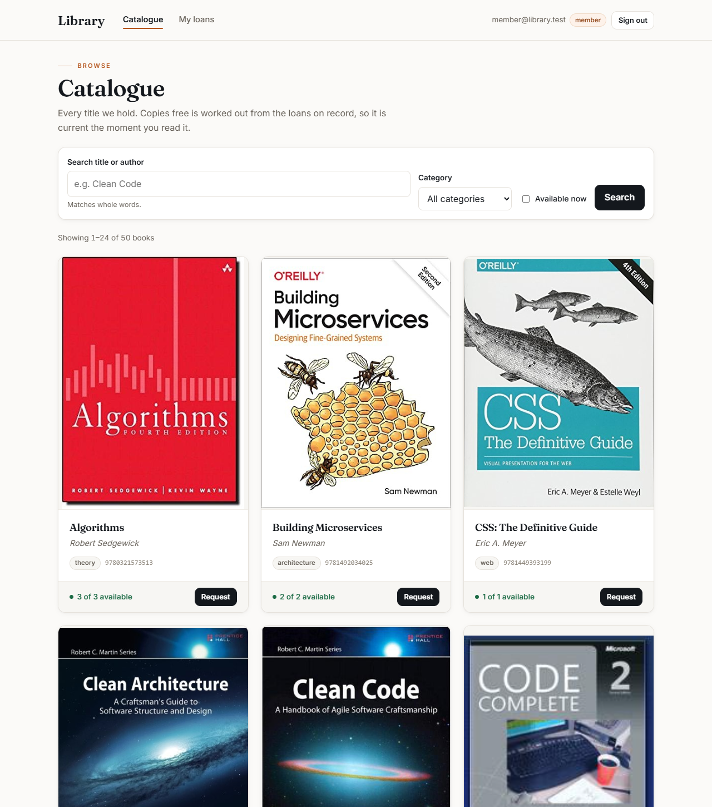

---

## Contents

1. [Features](#features)
2. [Technology stack](#technology-stack)
3. [Architecture](#architecture)
4. [Data model](#data-model)
5. [Roles and permissions](#roles-and-permissions)
6. [Security](#security)
7. [Getting started](#getting-started)
8. [Demo accounts](#demo-accounts)
9. [API reference](#api-reference)
10. [Screenshots](#screenshots)
11. [Testing](#testing)
12. [Project structure](#project-structure)

---

## Features

**For members**
- Browse and search a catalogue of 50 books across five categories, with pagination
- Filter by category, or show only books that have a copy on the shelf right now
- Request a book, and track the request until a librarian approves or declines it
- Join the reservation queue for a book whose copies are all out
- See their own loans, due dates, days remaining or overdue, and any fine accrued

**For librarians**
- Issue and return books, with the fine settled automatically on return
- A loan register: every book currently out, who has it, most overdue first
- Approve or decline member requests — approving issues the book on the spot
- Add, edit and withdraw books; adjust the number of copies
- Register walk-in borrowers who have no login account
- Record fine payments, or waive a fine (recording who waived it and when)

**For administrators**
- Everything a librarian can do
- Manage accounts: promote or demote roles, deactivate users
- Edit and delete member records

**Across the system**
- Availability is always calculated live from active loans, so it can never drift out of date
- Deleting a book or member that other records depend on is handled by an explicit policy
  (`block`, `cascade` or `nullify`) instead of leaving broken references behind
- Fully responsive interface, hand-written CSS, no UI component library
- Loading and error states in every view that fetches data

---

## Technology stack

| Layer | Technology |
| --- | --- |
| Frontend | React 18, React Router 6, hand-written responsive CSS |
| Backend | Node.js, Express 4, TypeScript (`strict: true`) |
| Database | MongoDB with Mongoose 8 |
| Authentication | JWT access tokens + httpOnly refresh cookie, bcrypt password hashing |
| Security | express-rate-limit, CORS, input validation middleware |
| Testing | Jest, Supertest, in-memory MongoDB |
| Shared contract | `shared/types.ts`, imported by both frontend and backend |

---

## Architecture

The frontend and backend are two separate programs that talk over HTTP/JSON. Both import
the same type definitions from `shared/types.ts`, so the API contract is defined once.

```
 React frontend                          Express + TypeScript backend
 ──────────────                          ─────────────────────────────
 components/  ──►  api/  ── HTTP/JSON ──►  routes  ──►  middleware  ──►  controllers
 (render UI)      (every fetch)            (path +      (auth, roles,    (parse request,
                                           guards)      validation)      send response)
                                                                               │
                                                                               ▼
                                                                          services
                                                                   (business rules)
                                                                               │
                                                                               ▼
                                                                  models ──► MongoDB
```

Each layer has one job:

| Layer | Responsibility |
| --- | --- |
| **Models** | Schemas, validation, hooks, virtuals, indexes |
| **Services** | Business rules and transactions — never touch the request or response |
| **Controllers** | Read the request, call a service, send the response |
| **Routes** | Map each method and path to a handler and declare who may call it |
| **Middleware** | Authentication, role checks, ownership checks, validation, errors, logging |
| **Frontend `api/`** | The only place the frontend calls `fetch` |

Permissions are declared directly in the route files, so the whole access model is
readable at a glance:

```ts
router.post("/",          authenticate, authorize("librarian"), ctrl.issue);
router.get("/:id/loans",  authenticate, ownsMemberRecord,       ctrl.loans);
```

---

## Data model

MongoDB stores five collections:

| Collection | Holds |
| --- | --- |
| `users` | Login accounts — email, hashed password, role |
| `members` | Borrower records, optionally linked to a user account |
| `books` | Titles, each carrying its reservation queue inside it |
| `loans` | One borrowing event, referencing a book and a member |
| `bookrequests` | A member's request for a book, and the librarian's decision |

```
   User                              Member
   ─────────────────                 ─────────────────────
   _id                    0..1   1   _id
   email        unique  ◄─────────── user          nullable, unique
   passwordHash (hidden)             name, email
   role                              membershipType
   isActive                          borrowLimit   (derived from membershipType)
                                     ▲
                                     │ member
                                     │
   Book                              Loan
   ─────────────────────             ─────────────────────
   _id  ◄──────────────────────────  book
   isbn          unique              member
   title, author, category           issuedAt, dueDate
   copiesTotal                       returnedAt    (empty while the loan is active)
   reservations[]  (embedded)        fineAmount    (fixed when the book is returned)
                                     waivedAt, waivedBy
```

**Stored vs calculated.** Some values are deliberately calculated rather than stored, so
they can never disagree with the data they come from:

| Value | How it is calculated |
| --- | --- |
| Copies available | `copiesTotal` − number of active loans for that book |
| Borrow limit | Looked up from the member's membership type |
| Accrued fine | Days overdue × fine per day (active loans only) |
| Days overdue / days left | From the due date and today's date |

**Referenced vs embedded.** Loans *reference* books and members because they are
independent records with their own lifecycle. The reservation queue is *embedded* inside
each book because a reservation has no meaning outside the book it belongs to.

**Database-level rules.** A unique partial index on `loans` guarantees a member can never
hold two active loans for the same title, even if two requests arrive at the same moment.

---

## Roles and permissions

| Action | Member | Librarian | Admin |
| --- | :---: | :---: | :---: |
| Browse and search books | ✓ | ✓ | ✓ |
| Reserve a book / request a book | ✓ | ✓ | ✓ |
| View loans | own only | ✓ | ✓ |
| View a member record | own only | ✓ | ✓ |
| Add, edit, delete books | | ✓ | ✓ |
| Issue and return books | | ✓ | ✓ |
| Approve or decline requests | | ✓ | ✓ |
| Record payment or waive a fine | | ✓ | ✓ |
| Register a walk-in member | | ✓ | ✓ |
| Edit or delete a member record | | | ✓ |
| Manage accounts and roles | | | ✓ |

In short: **a librarian runs the desk, an admin runs the institution.**

Every rule is enforced on the server by middleware. Hiding a button in the interface is
only a convenience — a request made directly to the API is refused in exactly the same way.

---

## Security

| Threat | Defence |
| --- | --- |
| **Password theft** | bcrypt with cost factor 12, hashed in a model hook. The hash is excluded from every query and every JSON response |
| **Account enumeration** | "Wrong password" and "no such account" return the same status and message |
| **Brute-force login** | 5 attempts per 15 minutes per IP, then `429 Too Many Requests` |
| **Accessing someone else's records (IDOR)** | Ownership middleware — a member asking for another member's loans gets `403` |
| **NoSQL injection** | Validation middleware rejects objects such as `{"$ne": null}` where a string is expected |
| **Mass assignment** | Every update endpoint whitelists its fields, so `role` can never be set by the client |
| **Token theft** | Short-lived (15 min) access token kept in memory only; refresh token in an httpOnly, `SameSite=Strict` cookie |
| **Revoked sessions** | Changing the password invalidates every existing refresh token; deactivated users are refused on their next request |
| **Leaked secrets** | All secrets come from `.env` (gitignored). The server refuses to start with a missing or placeholder JWT secret |
| **Sensitive logs** | The request logger redacts tokens and passwords |

**401 vs 403.** `401 Unauthorized` means *we don't know who you are* (missing, expired or
invalid token). `403 Forbidden` means *we know who you are, and you are not allowed*. The
frontend uses this difference: on a 401 it refreshes the token once and retries; on a 403
it never retries.

---

## Getting started

**Requirements:** Node.js 18 or later. MongoDB is optional — see the quick start.

### Quick start (no database needed)

Runs the API against a temporary in-memory MongoDB, already filled with demo data:

```bash
cd backend
npm install
npm run dev:local          # API on http://localhost:4000
```

In a second terminal:

```bash
cd frontend
npm install
npm start                  # App on http://localhost:3000
```

The in-memory data is reset every time the backend restarts.

### With a real MongoDB database

```bash
cd backend
npm install
cp .env.example .env       # then fill in the values below
npm run check:db           # confirms the connection works
npm run seed               # loads the demo data
npm run dev                # API on http://localhost:4000
```

### One-click public link

Double-click **`start.bat`** on Windows, or run **`./start.sh`** on macOS/Linux. It
installs dependencies, builds the frontend, starts the server and prints a public HTTPS
link through a Cloudflare tunnel. The link stays live only while the window is open.

### Environment variables

| Variable | Purpose | Default |
| --- | --- | --- |
| `PORT` | API port | `4000` |
| `MONGODB_URI` | MongoDB connection string | `mongodb://127.0.0.1:27017/library` |
| `JWT_ACCESS_SECRET` | Signs access tokens | **required** |
| `JWT_REFRESH_SECRET` | Signs refresh tokens | **required** |
| `ACCESS_TOKEN_TTL` | Access token lifetime | `15m` |
| `REFRESH_TOKEN_TTL` | Refresh token lifetime | `7d` |
| `BCRYPT_COST` | Password hashing cost (minimum 12) | `12` |
| `CORS_ORIGIN` | The frontend's address | `http://localhost:3000` |
| `LOGIN_RATE_LIMIT_WINDOW_MS` | Login rate-limit window | `900000` (15 min) |
| `LOGIN_RATE_LIMIT_MAX` | Login attempts allowed per window | `5` |
| `TRUST_PROXY` | Number of proxies in front of the server | `0` |

Generate a secret with:

```bash
node -e "console.log(require('crypto').randomBytes(48).toString('hex'))"
```

---

## Demo accounts

After seeding, all accounts use the password **`library-demo-2026`**:

| Email | Role |
| --- | --- |
| `admin@library.test` | Admin |
| `librarian@library.test` | Librarian |
| `member@library.test` | Member |
| `premium@library.test` | Premium member |

The demo data includes an overdue loan with an accrued fine, a book whose only copy is out
with a member queued behind it, and a walk-in borrower with no login account.

---

## API reference

Base URL: `http://localhost:4000`

Every successful response has the shape `{ "data": ... }`. Every error has the same shape
across all endpoints:

```json
{ "error": { "code": "...", "message": "...", "details": {}, "requestId": "..." } }
```

### Authentication

| Method | Path | Description |
| --- | --- | --- |
| POST | `/api/auth/register` | Create an account |
| POST | `/api/auth/login` | Sign in, receive an access token |
| POST | `/api/auth/refresh` | Get a new access token using the refresh cookie |
| POST | `/api/auth/logout` | Sign out |
| GET | `/api/auth/me` | The signed-in user |
| PATCH | `/api/auth/password` | Change password |

### Books and reservations

| Method | Path | Access | Description |
| --- | --- | --- | --- |
| GET | `/api/books` | All | List books — `?search=` `?category=` `?available=` `?page=` |
| GET | `/api/books/categories` | All | Categories with counts |
| GET | `/api/books/:id` | All | One book |
| GET | `/api/books/:id/availability` | All | Live availability |
| POST | `/api/books` | Staff | Add a book |
| PATCH | `/api/books/:id` | Staff | Edit a book |
| DELETE | `/api/books/:id` | Staff | Delete — `?onDelete=block\|cascade\|nullify` |
| POST | `/api/books/:id/reserve` | All | Join the reservation queue |
| DELETE | `/api/books/:id/reserve` | Own | Leave the queue |

### Members

| Method | Path | Access | Description |
| --- | --- | --- | --- |
| GET | `/api/members` | Staff | List members |
| GET | `/api/members/:id` | Own / Staff | One member |
| GET | `/api/members/:id/loans` | Own / Staff | A member's loans — `?active=true` |
| POST | `/api/members` | Staff | Register a walk-in member |
| PATCH | `/api/members/:id` | Admin | Edit a member |
| DELETE | `/api/members/:id` | Admin | Delete — `?onDelete=` policy |

### Loans

| Method | Path | Access | Description |
| --- | --- | --- | --- |
| GET | `/api/loans` | Staff | Loan register — `?view=active\|overdue\|all` |
| POST | `/api/loans` | Staff | Issue a book |
| PATCH | `/api/loans/:id/return` | Staff | Return a book and settle the fine |
| PATCH | `/api/loans/:id/pay` | Staff | Record a fine payment |
| PATCH | `/api/loans/:id/waive-fine` | Staff | Waive a fine |

### Requests

| Method | Path | Access | Description |
| --- | --- | --- | --- |
| POST | `/api/requests` | All | Request a book |
| GET | `/api/requests/mine` | Own | My requests |
| GET | `/api/requests` | Staff | The request queue — `?status=` |
| PATCH | `/api/requests/:id/approve` | Staff | Approve and issue the book |
| PATCH | `/api/requests/:id/decline` | Staff | Decline with a reason |
| DELETE | `/api/requests/:id` | Own | Withdraw a request |

### Accounts

| Method | Path | Access | Description |
| --- | --- | --- | --- |
| GET | `/api/users` | Admin | All accounts |
| PATCH | `/api/users/:id/role` | Admin | Change a user's role |
| PATCH | `/api/users/:id/active` | Admin | Activate or deactivate |

### Health

| Method | Path | Description |
| --- | --- | --- |
| GET | `/health` | Server status |

Every response carries an `X-Request-Id` header, and the same id appears in error bodies
and server logs, so any failure can be traced.

### Status codes

| Code | Meaning | Example |
| --- | --- | --- |
| 200 | Success | Listing books |
| 201 | Created | Issuing a loan |
| 204 | Success, no content | Logout, delete |
| 400 | Malformed request | Invalid id or input |
| 401 | Not authenticated | No token or expired token |
| 403 | Not permitted | A member reading another member's loans |
| 404 | Not found | Unknown book |
| 409 | Conflict | No copy available, duplicate ISBN |
| 422 | Rejected by a business rule | Borrow limit reached, weak password |
| 429 | Too many requests | Sixth login attempt in 15 minutes |
| 500 | Server error | Details are never exposed to the client |

---

## Screenshots

### Landing page


### Sign in
One form for all three roles.

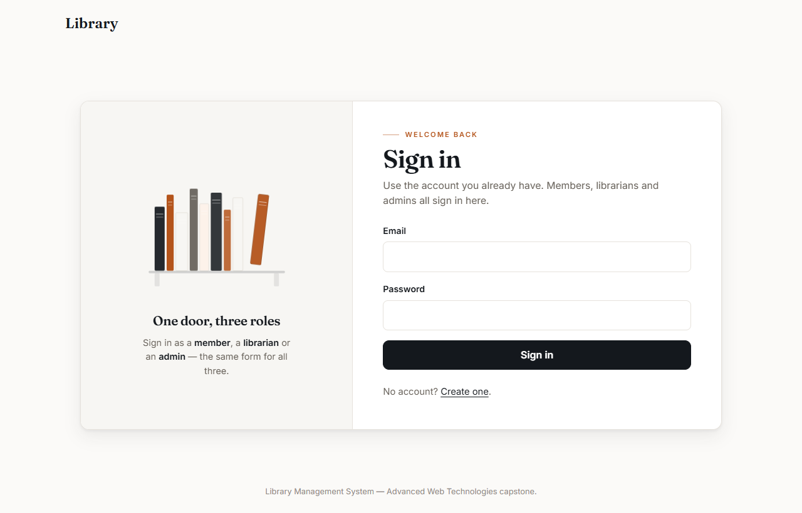

### Catalogue
50 books across five categories, with search, category filter and an "available now"
filter. Availability is calculated live from active loans.


### Member loans
The overdue loan is flagged and shows the fine accrued so far. All figures come from the
server.

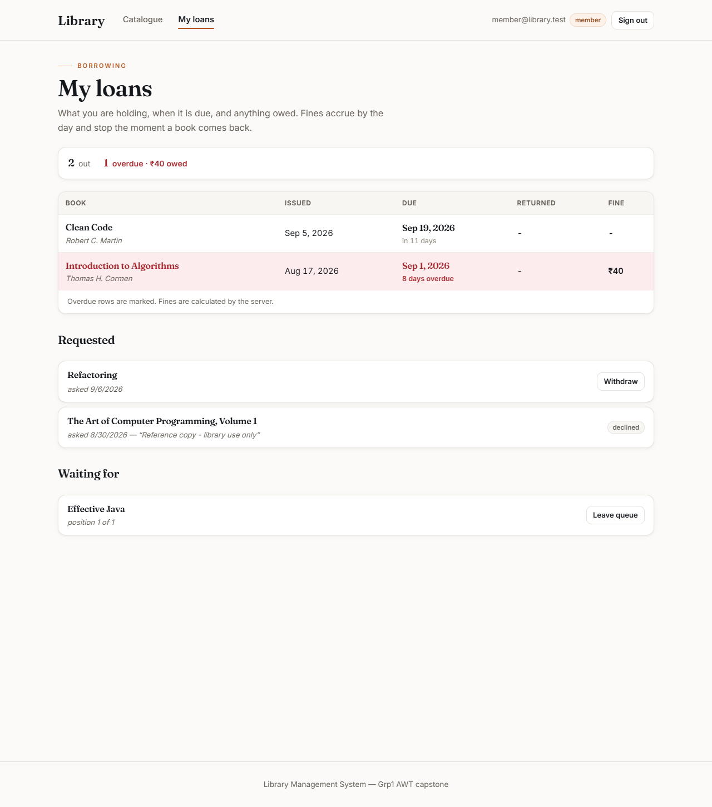

### Issuing a book
The server refuses to issue a book with no copy available (`409 Conflict`), and the error
shows the request id that traces it in the logs.

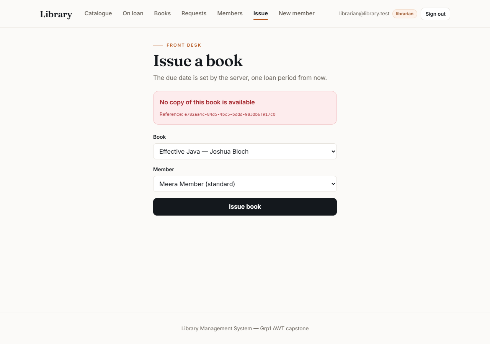

### Loan register
Every book currently out, who has it and how many days are left or overdue. Books can be
returned and fines waived directly from here.

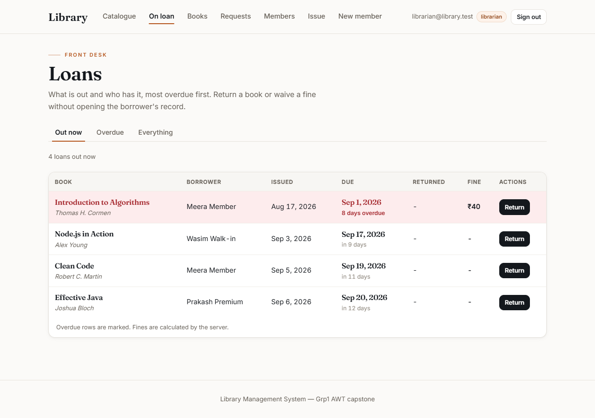

### Book management
Add, edit, adjust copies and withdraw books from lending.

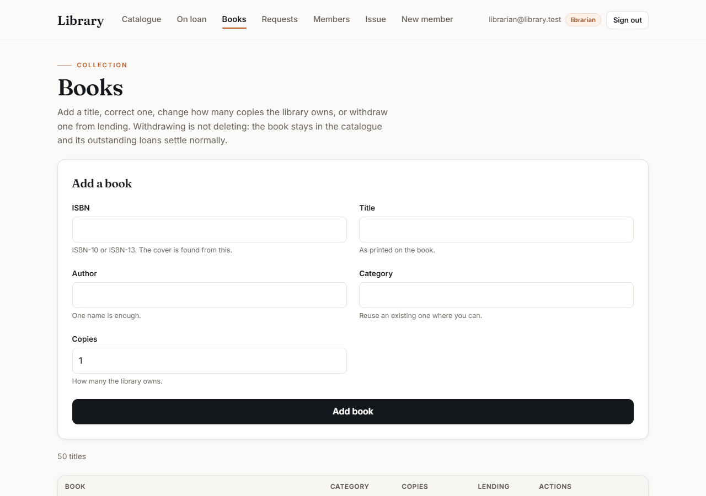

### Request queue
A librarian approves a member's request, and the book is issued immediately.

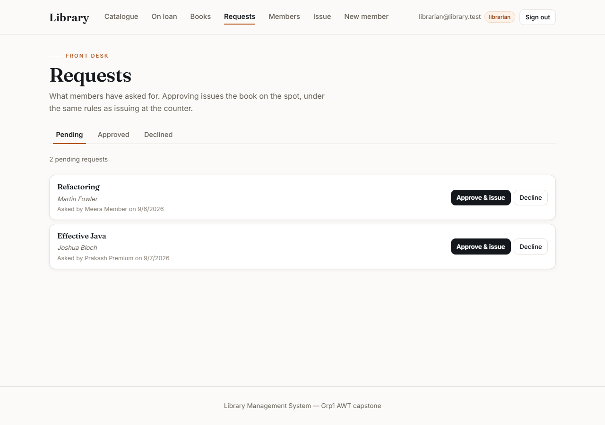

### Account management (admin only)

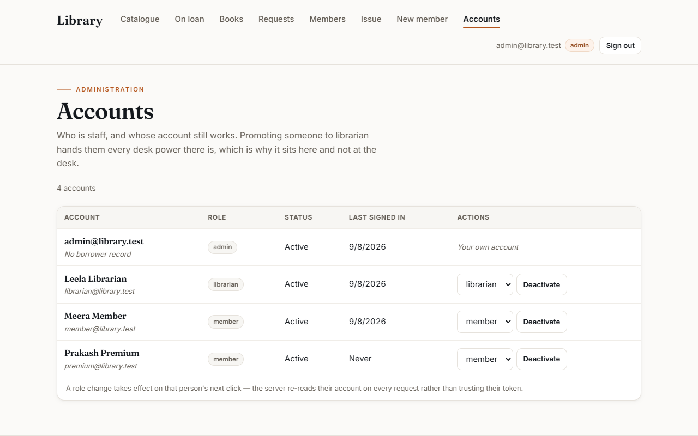

### Register a member
A controlled form with client-side validation.

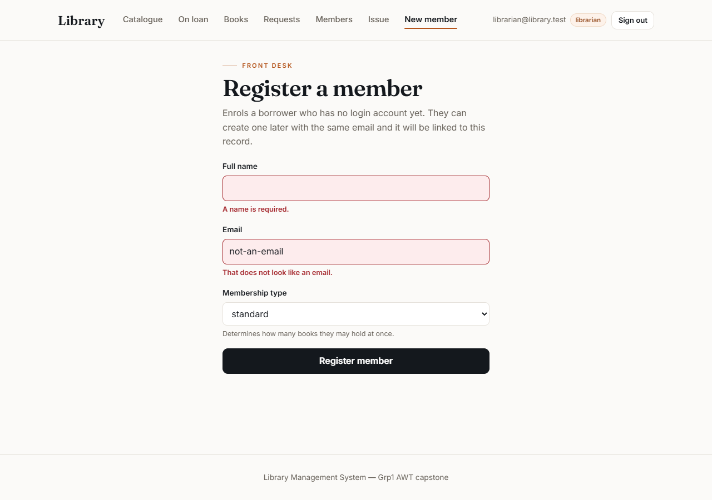

### Mobile

| Landing | Catalogue | Loans |
| --- | --- | --- |
| 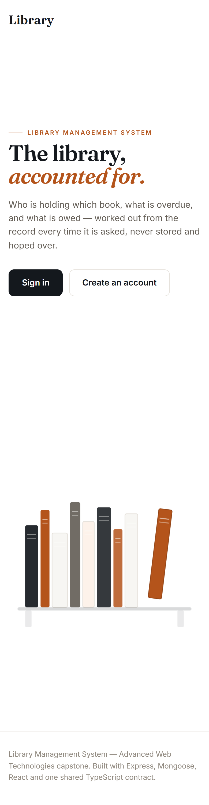 | 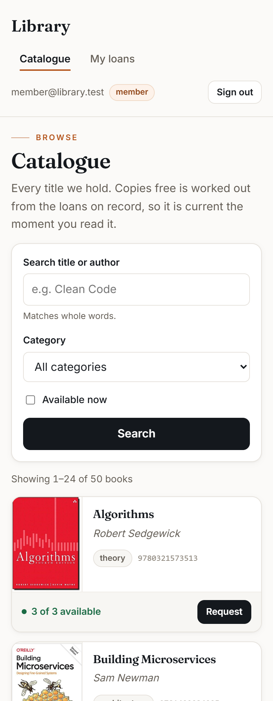 | 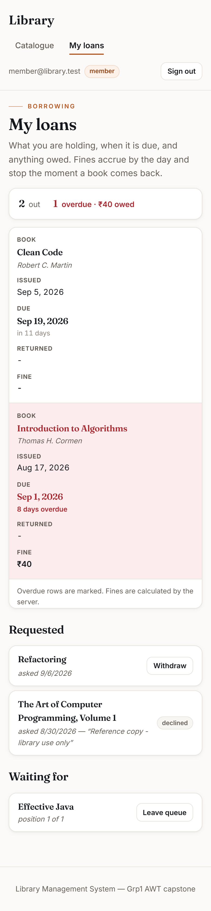 |

---

## Testing

```bash
cd backend
npm test                   # 194 automated tests against an in-memory MongoDB
npm run typecheck          # TypeScript strict-mode check
npm run check:layering     # fails if any service touches the request or response
```

The tests cover authentication, role and ownership checks, the IDOR case, rate limiting,
NoSQL injection, mass assignment, loan and fine rules, reservations, and delete policies.

---

## Project structure

```
shared/
  types.ts               API contract shared by frontend and backend
backend/
  src/
    models/              Mongoose schemas, hooks, virtuals, indexes
    services/            Business rules
    controllers/         Request handling
    routes/              Endpoints and their access guards
    middleware/          Authentication, authorization, validation, errors, logging
    errors/              Error class hierarchy
    config/              Environment configuration
    app.ts               Express application
    server.ts            Starts the server
  __tests__/             Automated tests
  scripts/               Development and database utilities
  seed.ts                Demo data
frontend/
  src/
    api/                 All communication with the backend
    auth/                Authentication context and protected routes
    components/          React components
    hooks/               Shared React hooks
    routes.js            Page routes and their access rules
    App.js               Application shell
screenshot/              Application screenshots
start.bat / start.sh     One-click start with a public link
```
